# Movie Ticket Booking System 🎬🍿

---

## 🏗️ 1. System Architecture (สรุปภาพรวมระบบ)

เพื่อให้เข้าใจง่ายที่สุด ระบบเราทำงานเหมือน **"ร้านอาหาร"** ครับ:

```mermaid
flowchart LR
    A["👤 User<br>(ลูกค้า)"] -- "สั่งอาหาร/ดูเมนู" --> B["🌐 Frontend<br>(พนักงานรับออเดอร์)"]
    B -- "ส่งคำสั่งไปในครัว" --> C["🚀 Backend Go<br>(เชฟเมนหลัก)"]

    subgraph Storage ["คลังข้อมูล & สถานะที่นั่ง"]
        C -- "จดบันทึกถาวร" --> D[("🍃 MongoDB")]
        C -- "แปะป้ายจองที่นั่ง" --> E[("⚡ Redis")]
    end

    subgraph Background ["งานหลังร้าน (Async)"]
        C -- "ฝากงานไว้ในท่อ" --> F{{"📦 Kafka"}}
        F -- "หยิบงานไปทำ" --> G["📧 Email Service"]
    end
```



### อธิบายง่ายๆ ว่าใครทำอะไร:

1.  **Frontend (Vue.js)**: คือหน้าตาเว็บที่ลูกค้าเห็น มีหน้าที่รับคำสั่งจากลูกค้าว่าอยากดูเรื่องไหน จองที่ไหน แล้วส่งต่อให้หลังบ้าน
2.  **Backend (Go)**: เป็นหัวใจหลัก เป็นคนตัดสินใจว่า "ที่นั่งนี้จองได้ไหม?" "จ่ายเงินผ่านหรือเปล่า?"
3.  **Redis (The Lock)**: เหมือน **"สติกเกอร์แปะจอง"** จังหวะที่มีคนกดเลือกที่นั่ง เราจะรีบเอาสติกเกอร์ไปแปะไว้ใน Redis ก่อน ถ้ามีคนอื่นมาจองซ้ำในเสี้ยววินาทีเดียวกัน ระบบจะเห็นสติกเกอร์นี้แล้วบอกว่า "ที่นี่มีคนจองแล้วจ้า"
4.  **MongoDB (The Ledger)**: เหมือน **"สมุดบัญชีร้าน"** เมื่อจ่ายเงินเสร็จแล้ว เราจะบันทึกข้อมูลแบบถาวรลงที่นี่ (ใคร จองที่ไหน เมื่อไหร่)
5.  **Kafka & Email Service**: เหมือน **"แผนกเดินเอกสาร"** พอจองเสร็จ เชฟ (Backend) ไม่ต้องเสียเวลาไปส่งเมลเอง แค่ตะโกนบอก Kafka ว่า "ส่งเมลยืนยันให้ลูกค้าคนนี้ทีนะ" แล้วเชฟก็กลับไปรับออเดอร์คนอื่นต่อได้ทันที ส่วนการส่งเมลจะทำเป็นเบื้องหลังไปครับ

---

## 🛠️ 2. Tech Stack Overview

### Backend (Golang)

- **Framework**: [Gin Gonic](https://github.com/gin-gonic/gin) (Web Framework ที่เน้นความเร็วและประสิทธิภาพสูง)
- **Database**: [MongoDB](https://www.mongodb.com/) (เก็บข้อมูลหนังและรอบฉายในรูปแบบ Document ที่ยืดหยุ่น)
- **Cache / Lock**: [Redis](https://redis.io/) (ใช้ทำ **Distributed Lock** เท่านั้น ไม่ใช่แค่ Cache)
- **Messaging**: [Apache Kafka](https://kafka.apache.org/) (ใช้ทำ Event-Driven Architecture สำหรับระบบแจ้งเตือน)
- **Real-time**: [Gorilla WebSocket](https://github.com/gorilla/websocket) (ใช้ส่งสถานะที่นั่งแบบสดๆ หาผู้ใช้ทุกคน)
- **Auth**: [Google OAuth 2.0](https://developers.google.com/identity/protocols/oauth2) (ระบบยืนยันตัวตนผ่าน Google Account)

### Frontend (Vue.js)

- **Framework**: Vue 3 + Vite
- **Styling**: TailwindCSS / Vanilla CSS (เน้นความสวยงามใข)
- **State Management**: Pinia (จัดการ State ภายในแอป)

### Deployment (Infrastructure)

- **Containerization**: [Docker](https://www.docker.com/) + Docker Compose (จำลองสภาพแวดล้อม Production ให้รันได้ทุกที่)
- **Monitoring**: [Kafdrop](https://github.com/obsidiandynamics/kafdrop) (UI สำหรับดู Kafka Topic/Message)

---

## 🔄 3. Booking Flow (ขั้นตอนการทำงาน)

1.  **Sign In (เข้าสู่ระบบ)**: ผู้ใช้เข้าสู่ระบบผ่าน Google Account **(เพื่อความใช้งานง่าย Mock คนเข้าคนแรกเป็น Admin ที่เหลือเป็น User)**
2.  **Selection (เลือกหนัง)**: ผู้ใช้เลือก `Movie` และ `Showtime` ที่ต้องการ
3.  **Seat Locking (ล็อคที่นั่ง Real-time)**:
    - ทันทีที่คลิกที่นั่ง **Frontend** จะยิง `POST /api/lock`
    - **Backend** จะสร้าง **Distributed Lock** ใน Redis โดยอ้างอิงจาก `MovieID` + `StartTime`
    - **WebSocket** กระจายสถานะ `LOCKED` ไปยังผู้ใช้คนอื่นๆ ที่ดูรอบเดียวกันทันที (คนอื่นจะเห็นเป็นสีแดง)
4.  **Payment Initiation (เข้าสู่การจ่ายเงิน)**:
    - เมื่อกด "จอง/ชำระเงิน" ระบบจะต่ออายุ Lock (Extend TTL) ให้เป็น 5 นาที
    - สร้าง **Payment Lock** เพื่อกันไม่ให้ผู้ใช้ไปกดเปลี่ยนที่นั่งระหว่างจ่ายเงิน
5.  **Confirmation (ยืนยันผล)**:
    - เมื่อชำระเงินสำเร็จ (Mock) **Backend** จะอัปเดตสถานะเป็น `BOOKED` ลง MongoDB (Atomic Update)
    - ปลดล็อค Redis (Release Lock)
    - **WebSocket** แจ้งทุกคนว่าที่นั่งนี้ "ขายแล้ว" (`BOOKED`)
6.  **Audit & Notification (ทำงานเบื้องหลัง)**:
    - Backend ส่ง Event `BOOKING_SUCCESS` เข้าไปใน **Kafka**
    - **Email Service** (Consumer) ที่รออยู่ จะหยิบ Event ไปส่งอีเมลยืนยัน **(Mock ในหลังบ้าน)**
    - **Audit Log** บันทึกประวัติการจองเก็บไว้ตรวจสอบ

---

## 🔐 4. Redis Lock Strategy (หัวใจสำคัญ)

เพื่อแก้ปัญหา **"Double Booking"** (แย่งที่นั่งกัน)

- **Uniqueness**: รับประกันความไม่ซ้ำกัน 100% ด้วยการใช้ ID หนัง + เวลาฉายจริง + ID ที่นั่ง
- **Atomicity (SETNX)**: ใช้คำสั่ง `SETNX` ของ Redis ซึ่งเป็น Atomic Operation ทำให้มั่นใจได้ว่าจะมี **"ผู้ที่ได้ล็อคที่นั่งคนเดียว"** ที่ได้ล็อคที่นั่งไปครอง แม้จะมีการกดจองเข้ามาพร้อมกันในเสี้ยววินาทีก็ตาม
- **TTL (Auto-Expire)**: ถ้าคนจองหายไปเฉยๆ ล็อคจะหลุดเองภายใน 5 นาที (ป้องกัน Deadlock ที่นั่งค้าง)
- **Ownership**: เฉพาะคนที่ล็อคเท่านั้นที่มีสิทธิ์ปลดล็อค หรือจองที่นั่งนั้นต่อได้

---

## 📨 5. Message Queue Strategy (Kafka)

- **Topic**: `booking_events`
- **Events**:
  - `BOOKING_SUCCESS`: ยิงเพื่อส่งเมล
  - `SYSTEM_ERROR` / `AUDIT_LOG`: เก็บ Log ไว้ดูย้อนหลัง
- **ข้อดี**: ถ้าเซิร์ฟเวอร์ส่งเมลล่ม หรือช้า ผู้ใช้ก็ยังจองตั๋วได้สำเร็จตามปกติ ไม่ต้องรอนาน ระบบจะ Retry ส่งเมลให้เองทีหลัง

---

## 🚀 6. How to Run (วิธีรันระบบ)

**สิ่งที่ต้องมี**: Docker & Docker Compose

1.  **Clone & Start**:
    ```bash
    git clone https://github.com/Ho-Sittichai/movie-ticket-project.git
    cd movie-ticket-project
    docker-compose up --build
    ```
2.  **Access**:
    - Frontend (หน้าเว็บ): `http://localhost:5173`
    - Backend API: `http://localhost:8080`
    - Kafka UI (ดู Event): `http://localhost:9000`

---

## ⚖️ 7. Assumptions & Trade-offs (ข้อควรคำนึง)

- **Consistency vs. Availability**: ในระบบการเงิน/การจอง เราเน้น **Strong Consistency** (ข้อมูลต้องเป๊ะ) มากกว่าความเร็วเพียงอย่างเดียว เราจึงใช้ Redis Lock + Mongo Atomic Update
- **Seat Mapping**: ในเดโมนี้สมมติว่าเป็นผังที่นั่งแบบ Fixed เพื่อความง่ายต่อการเข้าใจ (ของจริงอาจต้องเป็น Dynamic Grid)
- **Kafka Overhead**: สำหรับโปรเจกต์ขนาดเล็ก Kafka อาจดูใหญ่เกินความจำเป็น แต่เราใส่มาเพื่อโชว์โครงสร้างแบบ **Enterprise Scalability** และ **Event-Driven Pattern**
